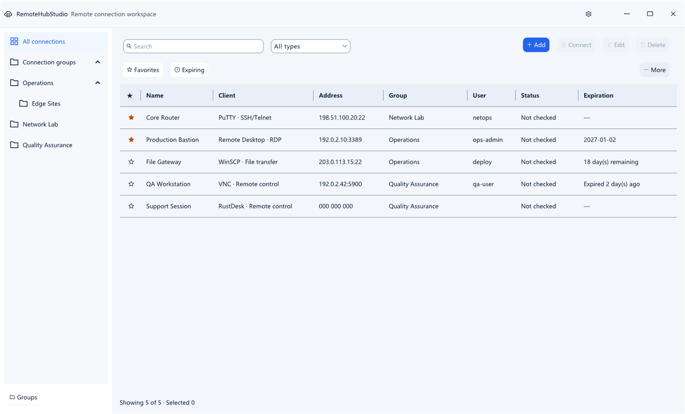
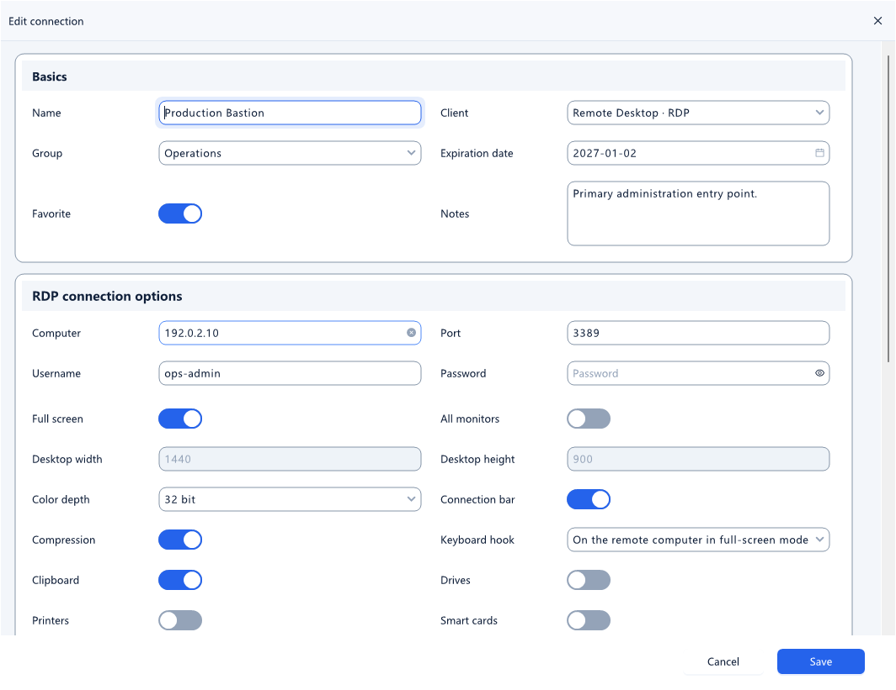
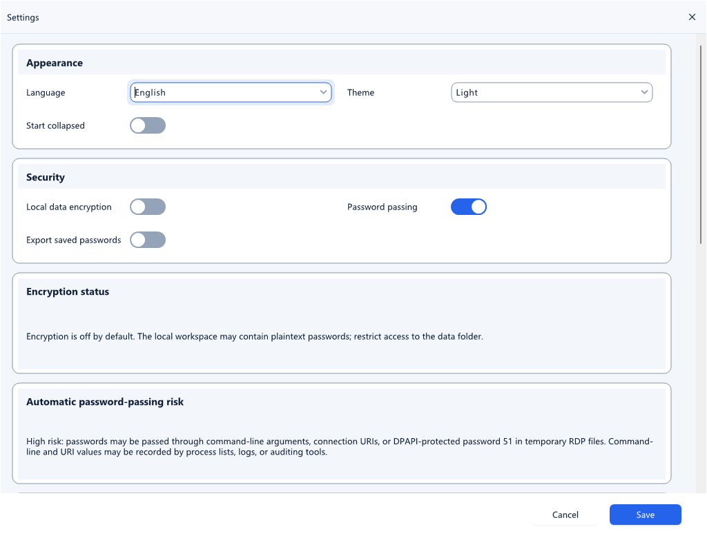

# RemoteHubStudio

**English** | [简体中文](README.zh-CN.md)

RemoteHubStudio is a Windows remote-connection profile manager. It keeps connections and nested groups in one portable workspace and launches remote clients already installed on the computer.

> RemoteHubStudio does not bundle or license any third-party remote-client executable. Install the clients you use separately and follow their respective license terms.

## Screenshots

### Connection workspace



### Connection editor



### Settings



All screenshots use the English interface. The application also includes Simplified Chinese and supports additional JSON language packs.

## Quick start

Download a stable or daily preview ZIP from [Releases](https://github.com/1609676823/RemoteHubStudio/releases); versions containing `nightly` are previews. Most users should select the **self-contained** `win-x86`, `win-x64`, or `win-arm64` package for their CPU, extract all files, and run `RemoteHubStudio.exe` without installing .NET separately. **Framework-dependent** and **win-portable** packages require the .NET 10 Windows Desktop Runtime; launch portable packages using `Start-RemoteHubStudio.cmd` or `dotnet RemoteHubStudio.dll`. See [deployment targets and modes](docs/DEPLOYMENT.md).

Building from source requires Windows and the .NET 10 SDK. NuGet restore downloads AntdUI.

```powershell
dotnet restore .\RemoteHubStudio.slnx
dotnet build .\RemoteHubStudio.slnx -c Release
dotnet run --project .\RemoteHubStudio\RemoteHubStudio.csproj -c Release
```

On first launch, open **Settings → External clients** and select the executable for each client you intend to use. Microsoft Remote Desktop uses the Windows-provided `mstsc.exe`; all other predefined clients must be installed separately.

## Features

- Manage connections and nested groups in one workspace. A connection can store its applicable username and password, favorite state, expiration date, notes, private key, executable override, custom arguments, RDP settings, and client-specific options.
- Search by name, address, type, or notes; filter by client, group, favorites, or expiration state; and perform multi-row status checks or deletion.
- Add saved connections or use **Quick connect** without adding a profile to the workspace.
- Use a shared connection-editor shell with a dedicated options page for each of the 12 connection types. Protocol, target, port, authentication, and advanced fields adapt to the selected client and mode.
- Show username and password fields only when the selected client mode uses them. Radmin, RealVNC, and the Telnet modes of PuTTY, SecureCRT, and MobaXterm hide and clear authentication values that do not apply.
- Configure RDP display, compression, Windows-key handling, audio, credential prompts, automatic reconnect, and clipboard, drive, printer, smart-card, COM, POS, camera, and microphone redirection.
- Export all data or the currently filtered view as portable JSON (`.rhs.json`), and import JSON or CSV data.
- Launch clients without a command shell by using discrete argument tokens. Custom templates are tokenized before substituting `{host}`, `{ip}`, `{port}`, `{username}`, `{key}`, and the optional `{password}`.
- Save through a same-volume temporary file, durable disk flush, and atomic replacement while retaining the previous revision for automatic recovery.
- Follow the Windows theme or select light or dark mode, with Per-Monitor V2 high-DPI support and responsive dialogs.
- The title bar offers separate **Minimize to tray** and standard minimize buttons. Right-click the tray icon to open or exit, or double-click it to restore the window, preserving its maximized state. **Close to tray** in Settings controls the close button separately.
- Launching the app again activates the existing instance, including a hidden window or an open dialog. Original application and tray icons, editable vector sources, and multiple export sizes are in `RemoteHubStudio/Assets`.

## Supported clients

| Client | Protocols or modes | Executable source |
| --- | --- | --- |
| Microsoft Remote Desktop | RDP | Windows-provided `mstsc.exe` |
| PuTTY | SSH, Telnet | External installation |
| Xshell | SSH, Telnet, SFTP | External installation |
| Xftp | SFTP, FTP | External installation |
| WinSCP | SFTP, SCP, FTP, FTPS, WebDAV, WebDAVS | External installation |
| SecureCRT | SSH2, SSH1, Telnet | External installation |
| MobaXterm | SSH, Telnet | External installation |
| VNC Viewer | TightVNC, RealVNC, UltraVNC | External installation |
| Radmin Viewer | Control, View, Telnet, File, Shutdown, Chat, Voice, Message | External installation |
| ToDesk | Device connection | External installation |
| RustDesk | Remote control, File transfer, View camera, Port forward, RDP tunnel, Terminal | External installation |
| Custom | User-defined executable and argument template | User supplied |

### Executable resolution

Configure external clients under **Settings → External clients**. TightVNC, RealVNC, and UltraVNC use separate paths so implementation-specific arguments cannot be sent to the wrong viewer. A connection-level **Executable** override may also be set.

RemoteHubStudio resolves an executable in this order:

1. The connection-level executable override.
2. The matching global client or protocol implementation setting.
3. A conventional executable in the application directory or an explicit `PATH` entry.

Remote UNC executables and `.cmd` or `.bat` scripts are rejected.

### RustDesk notes

RustDesk connections support an optional self-hosted server, server key, and forced relay. Remote control uses the officially confirmed `--connect <id> --password <password>` form. File transfer, camera, port forwarding, RDP tunnel, and terminal are outbound modes supported by the current official client source. Management commands such as `--get-id`, `--set-id`, `--config`, and installation are intentionally not exposed as per-connection options.

When a target contains `?key=`, RemoteHubStudio omits automatic password passing so RustDesk can prompt instead, avoiding a current upstream argument-combination issue. See the [official client documentation](https://rustdesk.com/docs/en/client/#command-line-parameters), [maintainer CLI examples](https://github.com/rustdesk/rustdesk/discussions/3980), [RustDesk 1.4.9 command dispatch](https://github.com/rustdesk/rustdesk/blob/1.4.9/src/core_main.rs#L3706-L3743), and the [upstream issue](https://github.com/rustdesk/rustdesk/issues/14116).

## Interface and architecture

- Windows Forms targeting `.NET 10` (`net10.0-windows7.0`). RemoteHubStudio is Windows-only; RDP launching and optional DPAPI protection depend on Windows.
- AntdUI `2.4.8`, with system, light, and dark themes.
- Per-Monitor V2 high-DPI mode. Dialogs and field grids adapt their columns and scrollable areas to the available width.
- The common connection form contains only name, client, group, expiration date, favorite state, and notes. A distinct `ConnectionTypeOptionsPage` subclass for each client owns its protocol or mode, endpoint, authentication, and dedicated settings. Fixed single-protocol clients such as RDP and ToDesk do not show a redundant protocol selector.

The source tree is organized by responsibility:

| Path | Responsibility |
| --- | --- |
| `RemoteHubStudio/Domain` | Workspace, connection, group, settings, and RDP models |
| `RemoteHubStudio/Application` | Workspace operations, validation, limits, filtering helpers, and expiration rules |
| `RemoteHubStudio/Infrastructure` | Persistence, DPAPI protection, import/export, client launch plans, monitoring, and single-instance coordination |
| `RemoteHubStudio/UI` | Main window, dialogs, client-specific editors, responsive controls, and themes |
| `RemoteHubStudio/Localization` and `RemoteHubStudio/Languages` | Runtime localization and versioned language packs |
| `RemoteHubStudio.Tests` | Dependency-free console regression suite |

`Program.cs` initializes localization and single-instance coordination, loads the JSON workspace through the DPAPI-capable repository, applies the selected theme, composes the application services, and opens the main window.

## Localization

English and Simplified Chinese are built in. Additional locales can be supplied as versioned UTF-8 JSON language packs. Select **Follow system language** or a specific language in **Settings**. Saving a changed language restarts the application so every form, menu, and component switches consistently.

At runtime, packs are loaded in this order, with later layers overriding earlier ones:

1. Embedded language packs. Embedded English is the safe key and placeholder baseline.
2. `Languages` beside `RemoteHubStudio.exe`.
3. `data\Languages` beside `RemoteHubStudio.exe`.

To contribute a locale, copy [`RemoteHubStudio/Languages/en.json`](RemoteHubStudio/Languages/en.json), rename the file and its `locale` to a canonical BCP-47 tag, translate only values under `strings`, and preserve every key and format placeholder. See the [language-pack guide](RemoteHubStudio/Languages/README.md) for format validation, fallback rules, and safety limits, and the [WinForms designer language guide](docs/WINFORMS-DESIGNER-LANGUAGE.md) for preview behavior and reload steps.

## Security model

### Local data encryption

Encryption is **off by default**. In this mode, `workspace.json` is readable JSON and stored passwords may appear in plain text. Restrict access to the data directory.

Encryption can be enabled under **Settings → Security**. The complete workspace payload is then protected with Windows DPAPI `CurrentUser`. This protection is tied to the current Windows user's DPAPI key environment; it is not a portable cross-account or cross-device format and has no separate recovery password. Data may be unrecoverable if that Windows profile or its keys become unavailable.

On the first save that enables encryption, the application atomically replaces `workspace.json.bak` under the same DPAPI policy before committing the primary file—even if the primary file happens to be missing—so an old plain-text backup is not retained. During that transition, the backup matches the new primary. Later successful saves resume retaining the previous encrypted revision.

Precisely named legacy `workspace.corrupt.*.json` diagnostic files are also migrated atomically to protected envelopes before the encryption setting is committed. A migration failure blocks the settings commit. One migration processes at most 32 matching files and 256 MiB of aggregate physical data; exceeding either boundary fails without partially committing the encryption setting. New protected diagnostic envelopes bind the original length and payload hash in a separately protected small verification record, so an ordinary load does not have to decrypt the complete damaged payload again.

When backup recovery preserves damaged primary bytes, it always wraps them with the same `CurrentUser` protector, even if normal workspace encryption is still disabled. The diagnostic file therefore does not create another plain-text secret copy and can be unprotected only in the same Windows-user key environment.

### Automatic password passing

**Allow automatic password passing** is **on by default**, so saved passwords are passed automatically to supported clients. It can be disabled in Settings. While disabled, launch plans do not pass passwords to clients; enter them in the client or use the client's own authentication mechanism. A custom template containing `{password}` is rejected while this setting is disabled.

When automatic passing is enabled, supported clients may expose passwords in process arguments, session URIs, process-monitoring tools, logs, or audit records. When an RDP profile has a saved password, RemoteHubStudio writes a DPAPI `CurrentUser`-protected `password 51` field and makes a best-effort attempt to delete the unique temporary `.rdp` file after the client exits. This must not be treated as portable secret storage.

### Importing and exporting data and secrets

- **Import and export** offers **Export all data**, **Export current data**, and **Import data**. Current data means the connections visible after applying the current search, type, sidebar, favorites, and expiration filters. Export automatically includes their groups and complete parent-group chains.
- JSON export removes saved connection passwords by default. Importing that redacted file over a same-named connection clears its password as part of the complete profile update; the import confirmation explicitly warns about this behavior.
- **Include saved passwords in exports** is off by default. When enabled, password fields in portable files are plain text and are not protected by the local DPAPI setting.
- Notes, client options, and custom arguments are free text. RemoteHubStudio cannot reliably recognize tokens or passwords entered manually in these fields, so review them before export.
- The current portable JSON envelope contains groups and connections only. It does not include executable paths, window geometry, or local security preferences.
- Import remains compatible with CSV v2, CSV v1, and unversioned legacy files. CSV v2 restores RDP and client-specific options, including reversible spreadsheet-formula protection.
- JSON and CSV import explicitly ask whether the source's launch configuration is trusted. The default **No** disables executable overrides, custom arguments, private-key paths, WinSCP or RustDesk endpoint routing that could override the visible host, and RDP local-resource redirection. Choose **Yes** only for a trusted file. Imported group references can bind only to groups included in the same file, never to existing local groups by GUID.
- Imports match trimmed names using ordinal case-insensitive comparison. Same-named groups and connections retain their local identifiers and receive the imported configuration; new names are created. Duplicate names in the import or ambiguous same-named local records reject the complete import atomically.
- Portable JSON export and JSON or CSV import share a 16 MiB file-size limit. Export writes a same-directory temporary file and replaces the destination only after validation. CSV import also limits record count, column count, and individual field length.

### Workspace and content limits

- One workspace can contain at most 5,000 groups and 50,000 connections. Group nesting is limited to 64 levels. Import, merge, save, and load enforce these limits and use non-recursive linear validation to reject missing parents and cycles.
- One user-controlled string is limited to 256 Ki characters, and all persisted strings in one workspace are limited to 4 Mi characters in aggregate.
- `ToolPaths` is limited to 64 entries, each connection to 256 `Options`, and the complete workspace to 100,000 `Options` entries. Save, load, and portable import/export share these content budgets.

## Data locations and recovery

The default data root is `.\data` beside the executable. Relative paths are anchored to the application directory, not the process working directory. After exiting the application, copying the complete application folder moves its data with it. Encrypted data remains subject to the DPAPI `CurrentUser` limitation described above.

When upgrading from a build that used the legacy `%LOCALAPPDATA%\RemoteHubStudio` default, close the application and copy that directory's contents into `.\data` beside the new executable. The current user must be able to write to the application directory; avoid protected or read-only locations for portable deployments.

| Path | Purpose |
| --- | --- |
| `workspace.json` | Current workspace |
| `workspace.json.bak` | Previous successful revision; during the first encryption opt-in it matches the current revision |
| `workspace.corrupt.<UTC timestamp>-<GUID>.json` | Damaged primary bytes retained during backup recovery; always a DPAPI `CurrentUser`-protected envelope |
| `language-preference.json` | UI language selection, stored independently from the workspace |
| `Languages\` | User-maintained language packs with the highest runtime priority |
| `temp\` | Application temporary-data directory |
| `logs\` | Application log directory |
| `.\data\temp\rdp\*.rdp` | Unique RDP launch files; best-effort deletion occurs after process exit, and startup sweeps only application-owned names older than 24 hours |

A save first creates a unique same-volume temporary file in the data root. Only after a complete durable write and confirmation that the final envelope is at most 64 MiB does it replace the primary; the previous primary becomes `.bak`. Serialized plaintext for a protected workspace has an additional 32 MiB limit to avoid an unbounded intermediate allocation before DPAPI and Base64 expansion. If the primary cannot be loaded, the backup is validated and used while the damaged primary bytes are retained in a protected diagnostic envelope.

## Development and testing

Core regression checks are provided as a console program without an additional test-framework dependency:

```powershell
dotnet run --project .\RemoteHubStudio.Tests\RemoteHubStudio.Tests.csproj -c Release
```

Success prints `REMOTEHUBSTUDIO_TESTS_OK` and returns exit code `0`. Use `dotnet run`, not `dotnet test`, for this repository's regression suite.

## Automated builds and releases

Only the [All Releases parent workflow](.github/workflows/daily-release.yml) runs on a daily schedule. It calls the preview and stable child workflows **in parallel** using `workflow_call`. Both children and their build, test, and publication steps appear in the same workflow run. Neither child depends on the other succeeding. The parent and every child can also be run manually on their own.

| Task | Workflow | Triggers | Behavior |
| --- | --- | --- | --- |
| Parent | [All Releases](.github/workflows/daily-release.yml) | Daily at **00:17 UTC / 08:17 Asia/Shanghai**, or manual | Runs both publication children concurrently |
| Daily preview | [Nightly Release](.github/workflows/nightly-release.yml) | Parent call or manual | Updates a fixed preview tag such as `v0.1.0-nightly` and replaces its assets |
| Stable | [Stable Release](.github/workflows/release.yml) | Parent call, manual, or `vX.Y.Z` tag push | Builds and publishes a missing version; skips a published version |
| Build and test only | [Build Release Package](.github/workflows/build-release.yml) | Publication child call or manual choice of `nightly` / `stable` | Uploads an Actions artifact without creating a tag or Release |

**Run everything:** open **Actions → All Releases → Run workflow**, select the default branch (currently `master`), and run. To execute just one publication child, choose **Nightly Release** or **Stable Release** and click **Run workflow**. Choose **Build Release Package** to check packaging only. The nightly child no longer has its own timer, avoiding duplicate scheduled builds.

Both publication children share the build and test workflow and [publishing script](.github/scripts/publish-release.sh): restore dependencies, build Release, run the console regression suite, and create Windows x86, x64, ARM64, and portable ZIPs with a combined `SHA256SUMS.txt`. Every package includes language packs and license notices; runtime inclusion depends on deployment mode. Parent-triggered and standalone runs of the same channel share a concurrency lock to prevent overlapping asset replacements; different channels can run concurrently.

All manual entry points expose **deployment-mode**: `repository-default`, `self-contained`, `framework-dependent`, or `both`. Scheduled and tag builds read the commented [release-settings.psd1](.github/release-settings.psd1), defaulting to self-contained RID packages plus a portable package. Portable DLLs always require the framework, and this WinForms app does not support Linux/macOS. See [deployment documentation](docs/DEPLOYMENT.md) for configuration, Windows compatibility, tradeoffs, and local commands. Published stable assets remain unchanged; new targets/modes take effect in the next stable version.

**Previews:** build the default branch (currently `master`), even without new commits. To run manually, choose the default branch under **Actions → Nightly Release → Run workflow**. The base version comes from `<Version>` in `Directory.Build.props`: `0.1.0` uses `v0.1.0-nightly`; changing it to `0.2.0` starts `v0.2.0-nightly` and leaves the old preview at its last build.

Tags and asset names contain neither dates nor build numbers. For example, `RemoteHubStudio-v0.1.0-nightly-win-x64-self-contained.zip` keeps a consistent download URL. The embedded application version includes the run number and attempt (such as `0.1.0-nightly.12.1`), and release notes record the timestamp, source commit, and workflow link. Each successful update moves the preview tag to the exact commit built so its source matches the binary.

**Stable releases:** parent-triggered and manual runs read `<Version>` from the default branch. For `0.1.0`, an already published `v0.1.0` skips both building and publishing. Otherwise, the workflow builds and tests, then creates the missing tag and stable Release. If the tag already exists without a published release, its original commit is built and the stable tag is never moved. Prerelease versions such as `0.2.0-beta.1` skip stable publication while previews continue.

Consequently, **bumping `<Version>` to a new plain three-part version automatically publishes it on the next parent run**. During development, use a prerelease version such as `0.2.0-beta.1`, then change it to `0.2.0` when ready for a stable release. Pushing a stable tag still supports selecting a specific release commit:

```powershell
git tag -a v0.1.0 -m "Release 0.1.0"
git push https://github.com/1609676823/RemoteHubStudio.git v0.1.0
```

Tag-triggered releases require `vX.Y.Z` to match that commit's source version exactly; `v0.1.0-nightly` cannot trigger stable publication. The selected source commit and version are checked again before building to keep source, tags, and binaries consistent. Failed releases can be retried; already published stable assets are always preserved. Increment `<Version>` when beginning the next version to switch daily builds to its preview tag.

Build or test failures leave published releases untouched. During preview replacement, the release temporarily becomes a draft and is published after all assets and the tag are updated. An interrupted upload leaves a draft that can be resumed by rerunning the failed publication job. Actions artifacts are kept for 7 days; Releases retain the latest preview for each version and all stable versions. Date-based tags created by the earlier workflow are not automatically deleted.

Commit and push the workflows to GitHub's default branch to enable them. The supplied `GITHUB_TOKEN` handles publication without a personal token. Forks must update the repository conditions in the parent, nightly, and stable workflows. Enable Actions under **Settings → Actions → General** if necessary. Rolling previews require updates to `v*-nightly` tags to be allowed. Keep **Settings → General → Releases → Enable release immutability** disabled for this repository: that setting would lock newly published previews. The script fails without deleting or recreating an immutable release. See [GitHub's immutable release documentation](https://docs.github.com/en/code-security/concepts/supply-chain-security/immutable-releases).

Adjust the UTC cron expression (`17 0 * * *`) to change the schedule. GitHub may delay scheduled runs or disable them after 60 days without public repository activity; re-enable them from Actions when needed. See [GitHub's schedule documentation](https://docs.github.com/en/actions/reference/workflows-and-actions/events-that-trigger-workflows#schedule).

Related patterns: [RustDesk](https://github.com/rustdesk/rustdesk/tree/master/.github/workflows) separates fixed `nightly` and tagged release builds. [FFmpeg's website](https://ffmpeg.org/download.html) supplies source and links to third-party binaries; [BtbN](https://github.com/BtbN/FFmpeg-Builds#release-retention-policy) offers a floating `latest` alongside retained historical builds. This project uses one rolling preview tag per base version instead of a tag per day.

## Product metadata

The product name, version, authors, company, description, repository, project, release URLs, and license identifier are centralized in [`Directory.Build.props`](Directory.Build.props). Public project links target [GitHub](https://github.com/1609676823/RemoteHubStudio), and the runtime About dialog reads the generated assembly metadata.

This uses the standard .NET SDK build configuration mechanism: a single project can put these properties directly in its `.csproj`; this repository shares them between the application and tests through the automatically imported `Directory.Build.props`. `Program.cs` handles startup, while application code uses the read-only [`ProductInfo`](RemoteHubStudio/Configuration/ProductInfo.cs) accessor to read the application's own assembly, independently of test or designer entry assemblies.

- For a release, update only `<Version>` (currently `0.1.0`; prereleases such as `0.2.0-beta.1` are supported). The SDK derives numeric `AssemblyVersion` and `FileVersion` values and the full `InformationalVersion`. The About dialog uses `ProductInfo.Version`, which retains prerelease labels and omits build metadata after `+`; `ProductInfo.InformationalVersion` preserves the full version and any SDK-appended Git commit for diagnostics.
- Changing `<RepositoryUrl>` updates the default project, issues, releases, and license URLs. To use separate destinations, edit `PackageProjectUrl`, `IssuesUrl`, `PackageReleaseNotes`, or `LicenseUrl`.
- Changing `<Authors>` updates the default publisher and copyright author; `Company`, `Copyright`, `Description`, and `PackageLicenseExpression` can also be configured separately. The SDK generates standard attributes, and `AssemblyMetadata` embeds the remaining information.
- About previews in the designer and language packs use placeholders; runtime values come from the assembly, so versions, copyright, and links do not need to be maintained in C# or translations. Data-directory, workspace-format, and single-instance identifiers remain compatibility constants in code.

CI can override the version for a build with `dotnet publish .\RemoteHubStudio\RemoteHubStudio.csproj -c Release -p:Version=0.2.0` without editing source. Each project's `AssemblyName` and `RootNamespace` remain in its own `.csproj`.

References: [Generate assembly attributes from project properties](https://learn.microsoft.com/en-us/dotnet/standard/assembly/set-attributes-project-file), [Share build configuration with Directory.Build.props](https://learn.microsoft.com/en-us/visualstudio/msbuild/customize-by-directory?view=vs-2022).

## License

RemoteHubStudio is released under the MIT License; see [`LICENSE.txt`](LICENSE.txt). Third-party remote clients remain subject to their own licenses.

AntdUI 2.4.8 attribution and the complete Apache-2.0 license are included in [`THIRD-PARTY-NOTICES.txt`](THIRD-PARTY-NOTICES.txt). Build and publish outputs copy both the RemoteHubStudio license and the third-party notices.
